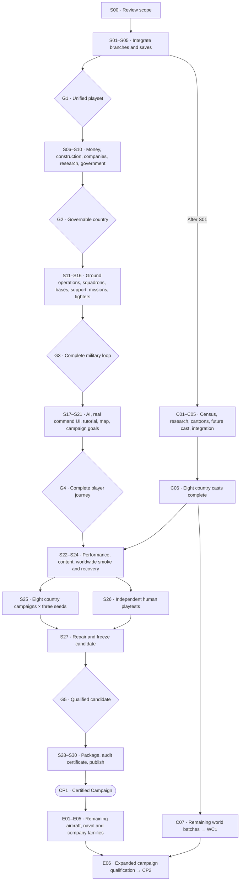

# Spheres — pathway to a certified campaign

**Approved pathway · 10 September 2026 · S01 complete; S02 is next.**

Source baseline: `5f7f355502f17bd6bd8f0383a2d14f0024fa7884`,
`codex/resume-spheres`. This plan follows the
[full game review](GAME_REVIEW_2026_09_10.md). The structured session register is
[campaign-pathway.json](planning/campaign-pathway.json).

## What the finish line means

**CP1 — Spheres Certified Campaign** is the approved internal release qualification target.
It names an exact build, rule profile, campaign period, countries, content
coverage, test evidence and known limitations. It is not an external certification
or a promise that every campaign will reproduce history or end in victory.

The certified period is **1 January 1990 through 31 December 2035**, including a
terminal save that can be loaded and continued normally. Ending on 1 January
2035 is insufficient. A defeat or country-ending transition can be an expected
scenario result when recovery/continuation is defined; it must not masquerade as
an unexplained simulation stall.

The first certificate targets eight country cases: **France, Japan,
India, Brazil, South Africa, Tonga, Saudi Arabia, and USSR → Russia**. All 137
starting countries also receive startup/recovery smoke tests, and all 23
successor identities receive explicit activation/load/UI checks. Those wider
checks do not imply that all countries passed full long-run or human playtests.
Roster counts will be re-established in S01 if the integrated roster changes.

CP1 includes these complete player loops:

- Choose a nation, understand its government and finances, save and resume.
- Fund construction financially, see province/national effects, finish work,
  staff/operate it, and understand output and shortages.
- Research components, design a vehicle, commission company development, buy
  actual company stock, receive it, maintain/refit it and field it.
- Use the integrated ground operations, diplomacy and peace systems with
  understandable results, shared forces and real supply/loss accounting.
- Operate light-attack/tactical-strike aircraft and a fighter family through
  squadrons, bases, readiness, **Support army**, **Strike target** and **Defend
  skies**. Routine support remains automatic within an explicit funding policy.
- Pursue peaceful or military goals, recover from setbacks and read the history
  of what changed. AI countries operate through the same economic rules.

The CP1 default rule profile must enable every system those loops require.
S01 records the exact settings and setup path. Optional/legacy profiles receive
separate coverage labels; no certified loop should require undisclosed flags or
developer commands. Existing approved requirements remain: company-owned stock,
paid development, financial construction, 2D cartoon people, and meaningful
**100,000+ triangle assembled inspection meshes for released aircraft** with
lighter catalogue/map detail.

The full aircraft/naval roster and global character programme remain in the
pathway. **WC1** closes worldwide historical/cartoon/future coverage. **CP2**
qualifies the expanded feature set. CP1 does not silently count those later
deliverables as finished.

## Read the markers

| Marker | Meaning |
| --- | --- |
| `S00` | Complete: user approved beginning S01 on 10 September 2026. |
| `S01`–`S30` | Thirty core development, qualification and release work sessions. S01 is complete; S02–S30 remain planned. |
| `C01`–`C07` | Character-production workstreams, with uniquely numbered country batches below. |
| `E01`–`E06` | Retained expansion work after the first certified release. |
| `G0`–`G5` | Evidence gates joining groups of sessions. |
| `CP1`, `WC1`, `CP2` | Separately earned campaign/content milestones. None is currently earned. |

Session status progresses through **Planned → In progress → Verification →
Complete**. Use **Needs repair** when a result fails and **Blocked** only when an
identified dependency prevents work. A completed session has accepted output and
linked evidence, not just code written or tests queued. Status changes must be
recorded; the roadmap itself never auto-completes sessions.

A session is a bounded work package, not a promised number of hours or one chat
turn. Large integration and country work can require several runs. Split work
into permanent suffixes such as `S03.a` and `S03.b`; the parent stays open until
all its acceptance checks pass. Do not renumber later sessions to hide overruns.

## The pathway map



This is a phase map, not a calendar. The session register below gives exact
prerequisites and permits useful overlap. Research/art can run alongside
engineering after their source identities are frozen. S25 and S26 can run in
parallel. Changes to shared simulation ownership need one integration owner;
concurrent contributors should use isolated work and explicit file/contract
boundaries.

## Session index

| Session | Deliverable | Prerequisites |
| --- | --- | --- |
| [S00](#s00) · Approve the certification scope | A reviewed scope, country matrix, content standard and definition of certification. | Review |
| [S01](#s01) · Freeze branches and the test baseline | One integration manifest with exact source revisions, compatibility risks, test inventory and reference hardware. | S00 |
| [S02](#s02) · Reconcile economy, population and fiscal ownership | One daily economy with one owner for population, jobs, GDP, government cash and debt. | S01 |
| [S03](#s03) · Reconcile companies and procurement | One company directory combining persistent identities with real supplier stock, development, ammunition and refit accounts. | S01 |
| [S04](#s04) · Reconcile warfare, diplomacy and map control | One operational warfare path connected to existing ownership, freight, diplomacy and equipment. | S01 |
| [S05](#s05) · Qualify the unified save and command system | G1: an integrated build that loads old campaigns and preserves unfinished transactions. | S02, S03, S04 |
| [S06](#s06) · Explain the country's money and recovery | A single dated explanation of treasury changes, upcoming commitments and useful recovery actions. | S05 |
| [S07](#s07) · Finish construction, jobs and operating outcomes | Build → staff → operate → understand the province/national effect through one connected flow. | S06 |
| [S08](#s08) · Complete supplier choice and reviewed imports | A useful domestic/foreign supplier market, including a viable path for countries without an arms industry. | S05, S07 |
| [S09](#s09) · Make research and design benefits readable | Research choices show which legal model choices unlock and why the player might want them. | S05, S03 |
| [S10](#s10) · Qualify government, succession and diplomacy | G2: governable nations with trustworthy political decisions, leaders and diplomatic consequences. | S05, C01 |
| [S11](#s11) · Finish the ground equipment-to-operation loop | Procured ground equipment produces understandable capability and losses in the integrated operations model. | S05, S09 |
| [S12](#s12) · Create real squadrons from owned aircraft | Saved squadrons refer to actual national aircraft, with simple establishment and revision choices. | S11, S08 |
| [S13](#s13) · Connect airbases, access and range | Geographic bases, visible rebasing and three clear improvements: Capacity, Support and Protection. | S12, S07 |
| [S14](#s14) · Fund automatic routine air-force support | One readiness view backed by maintenance, compatible stores and an explicitly bounded support policy. | S12, S13, S06, S08 |
| [S15](#s15) · Connect tactical missions to campaign results | Support army and Strike target create reviewed campaign orders and dated results. | S11, S13, S14 |
| [S16](#s16) · Add fighters and defensive aviation | G3: Defend skies works with a researched, company-supplied fighter platform. | S15, S09 |
| [S17](#s17) · Make AI countries use the same rules | Opponents and suppliers participate in affordable development, procurement, support and operations. | S08, S10, S16 |
| [S18](#s18) · Replace flight-demo data and finish playable aircraft art | Command, Aircraft, Bases and Reports use campaign truth and the three CP1 aircraft families have finished inspection assets. | S16, S14 |
| [S19](#s19) · Build outcome-aware tutorial and advisor guidance | An optional first-hour route that recognizes successful campaign outcomes, plus concise current advice. | S06, S07, S10, S18 |
| [S20](#s20) · Unify map, province and accessible room navigation | A consistent desktop/narrow-screen journey from map to province, facility, company and military decisions. | S07, S10, S18 |
| [S21](#s21) · Finish campaign goals, history and late-game continuation | G4: a coherent journey from choosing a nation to pursuing goals and understanding later outcomes. | S10, S15 |
| [S22](#s22) · Repair art measurement and qualify performance | A current art/memory audit and measured performance on the agreed reference machine and low-detail profile. | S18, S20 |
| [S23](#s23) · Audit certified-country history and cartoon coverage | Every certified-country party/component and served historical/future appearance is covered by the agreed content standard. | C06, S10, S20 |
| [S24](#s24) · Run worldwide startup and adversarial recovery checks | All starting/successor identities and core recovery paths have an explicit pass/fail result. | S17, S19, S20, S21, S22, S23 |
| [S25](#s25) · Run the complete 1990–2035 campaign matrix | Eight country cases × three recorded seeds reach 2035-12-31 with journals, checkpoints and reconciled terminal saves. | S24 |
| [S26](#s26) · Observe independent human playtests | Recorded opening and later-campaign usability sessions, with concrete confusion points and task success. | S24 |
| [S27](#s27) · Repair observed failures and freeze the candidate | G5: a release candidate with no critical or core-path significant defects and a complete evidence index. | S25, S26 |
| [S28](#s28) · Verify the exact packaged release | Matching Windows/Linux CI evidence and a clean-machine-tested distributable with embedded assets. | S27 |
| [S29](#s29) · Audit the campaign certificate | A dated CP1 evidence report naming exact scope, builds, countries, seeds, content coverage and limitations. | S28 |
| [S30](#s30) · Publish and prove the certified campaign release | CP1: the tagged playable build, package, player guide, certificate and verified recovery path. | S29 |
| [C01](#c01) · Freeze the worldwide party and institution census | A country/party/component inventory, frozen research cutoff and uniquely numbered historical/future work orders. | S01 |
| [C02](#c02) · Research historical leadership in bounded batches | CH-[nation]-B###: at most ten reviewed leadership chains/people per work session. | C01 |
| [C03](#c03) · Produce matching historical cartoon batches | CA-[nation]-B###: six to eight physically reviewed cartoons/appearance variants per session. | C02 |
| [C04](#c04) · Research and illustrate fictional successor batches | CF-[nation]-B###: a small reviewed set of institution-appropriate invented successors with distinct cartoons. | C02 |
| [C05](#c05) · Integrate and review each country batch | CI-[nation]-B###: exact manifest bindings and passing date/role/save checks for each content batch. | C03, C04, S10 |
| [C06](#c06) · Close the eight certified country casts | CS-[nation]: eight separate signed-off content manifests feeding S23. | C05 |
| [C07](#c07) · Finish and audit the rest of the world | WC1: the complete worldwide census, history, cartoon and future-candidate coverage ledger. | C06 |
| [E01](#e01) · Reconnaissance, early warning, tankers and transports | New support families with finite useful effects, real missions and complete procurement/support loops. | S30 |
| [E02](#e02) · Bombers, electronic warfare and target repair | Long-range strike and electronic support with understandable infrastructure effects and recovery. | E01 |
| [E03](#e03) · Helicopters and reusable drones | Rotary-wing and reusable drone families with supported army/recon/transport roles. | E01 |
| [E04](#e04) · Naval operations and maritime/carrier aviation | A unified naval operating foundation followed by maritime missions and carrier-compatible aircraft. | E01, E02 |
| [E05](#e05) · Deepen national company identity and historical fleets | Broader important-company research, supplier competition, civilian links and era-appropriate equipment catalogs. | S30 |
| [E06](#e06) · Qualify the expanded world campaign | CP2: a new exact-build certificate covering the expanded features and published country/date scope. | C07, E01, E02, E03, E04, E05 |

## Gates and evidence

| Gate | Required completion | What may be claimed |
| --- | --- | --- |
| G0 | S00 | Scope approved for implementation. |
| G1 | S01–S05 | One integrated playset with preserved ownership and compatible saves. |
| G2 | G1 + S06–S10 | Complete national finance/construction/supplier/research/government paths. |
| G3 | G2 + S11–S16 | Ground and three supported air missions use real campaign forces and results. |
| G4 | G3 + S17–S21 | AI and player-facing guidance complete the supported campaign journey. |
| G5 | G4 + S22–S27, including C06 | Required content, smoke, long-run, human and performance cells pass on a frozen candidate. |
| CP1 | G5 + S28–S30 | Exact packaged build has a published internal campaign certificate. |
| WC1 | C07 and all required country batches | Worldwide character/content scope is physically finished and audited. |
| CP2 | CP1 + WC1 + E01–E06 | Expanded systems have their own qualified campaign/build scope. |

Every session closes with a short record containing: session ID, input/output
commit, build/asset/save versions, files or behavior changed, scenario/seed/rule
settings, expected and actual result, command/checkpoint journal, tests actually
run, screenshots where relevant, unresolved defects and the next unlocked
session. Store the small index in the repository; large reproducible evidence
can be stored as release/CI artifacts with hashes and links. No missing log or
pending run is a pass.

No gameplay session is closed by a static review page alone. Artwork needs
physical asset and visual checks. A data import needs source and identity checks.
Simulation changes need conservation/migration and actual command-path checks.
Human usability requires human observations.

Proposed session closing format:

```text
Marker: S12 / Complete
Build: <commit + executable hash + save schema>
Delivered: <observable player outcome>
Evidence: <scenario, seed, rules, logs, save hashes, UI recording>
Remaining: <specific nonblocking issues, or none>
Unlocked: S13
```

This is a template, not an existing completion record. To resume later, a prompt
such as **“Continue S12 from the certified campaign pathway”** identifies the
work package; its recorded state determines the next action.

## Campaign qualification matrix

| Country case | Required emphasis |
| --- | --- |
| France | Integrated construction, employment/output, domestic development, purchases, military use and refits. |
| Japan | Imported inputs, workforce/qualification constraints and fiscal pressure/recovery. |
| India | Large population, industry/workforce scaling, viable development and bounded AI costs. |
| Brazil | Industrial expansion, trade costs and sustained fiscal adjustment. |
| South Africa | Resource-linked development, workforce distribution and access constraints. |
| Tonga | Useful affordable decisions and imported equipment without mandatory heavy industry. |
| Saudi Arabia | Resource-linked public finances, imported equipment and paid diversification. |
| USSR → Russia | A controlled valid succession case preserving people, territory, companies, cash/debt, stock, deliveries and reserved refits. |

These are test emphases, not guarantees about history or assumptions that every
country must follow the same economic strategy. The first seven country cases
also exercise normal government, diplomacy, save and military interactions.
Country-appropriate import paths count as a valid acquisition loop.

S25 expands into **`S25-FR`, `S25-JP`, `S25-IN`, `S25-BR`, `S25-ZA`, `S25-TO`,
`S25-SA`, `S25-SU-RU`**. Each contains three recorded seeds, proposed as
**1990, 7 and 42**, frozen before the results are examined. Each seeded case
requires uninterrupted and scheduled save/resume comparison: 24 long-run cases,
with paired continuity evidence. Further adversarial cases are additional and
must be labelled as fixtures.

Record yearly accounts and observations, with mandatory comparisons at
1990-01-01, 2000-01-01, 2010-01-01, 2020-01-01, the research cutoff and next day,
2030-01-01, and 2035-12-31. Test a terminal reload and normal continuation into
2036. Save mid-construction, mid-development, after purchase/before delivery,
during refit/rebasing and during an active mission in applicable cases. Do not
force a small country to build every type of facility simply to fill a checklist.

The Soviet succession case must explicitly arrange a valid transition using
the integrated rules when natural runs do not provide it. Never describe a
forced fixture as an organic historical outcome. Check all successor identities
separately; date-aware country selection and stale dead-government orders must
remain correct.

### Approved qualification criteria and provisional performance targets

- **Functional:** every required scenario reaches its expected state; all core
  orders, shortages, cancellations and recoveries work through ordinary controls.
- **Conservation:** no lost/duplicated property, money, population, capacity,
  equipment or ammunition; displayed confirmed effects agree with the server's
  rules. Save/resume comparisons are exact for supported deterministic state;
  any metadata-only exclusions are specified before the comparison.
- **Content:** complete represented party/component leadership chains and served
  historical/future cartoons for the eight certified cases through the endpoint.
  Explicit institutions replace inapplicable offices. Genuine uncertainty stays
  sourced and visible; an unknown required identity is not silently fabricated.
- **Usability:** at least five first-time people, at least eight recorded
  sessions covering the country set, opening and later-game tasks. At least
  four of the five newcomers complete the opening budget → construction →
  recorded-result → save path without facilitator help. Every participant can
  identify the government and explain an actionable blocker. This is a practical
  acceptance sample, not a statistical claim about all players.
- **Performance:** provisional targets on a named S01 reference machine are
  at least 30 FPS during representative map navigation and at most 200 ms p95
  for ordinary local UI controls. Record cold loading and simulation waits
  separately. S01 froze simulation/history p95 ≤300 ms, whole server-turn p95
  ≤400 ms and maximum ≤750 ms, and a 1 GiB ceiling for headless-process observed
  peak working set and sampled private memory. These are engineering targets,
  with scoped early/mid/late evidence in the [S01 performance baseline](campaign-certification/S01/PERFORMANCE_BASELINE.md).
  They are not sustained-throughput or total browser/GPU memory measurements.
  Measure low detail and detailed single-model inspection in S22.
- **Platforms:** locked build and real-browser CI on Windows/Linux; test the
  actual distributed package, offline assets, desktop and 390px layouts,
  keyboard navigation and supported recovery paths.

Human playtesting is a future session requiring available people. Agent-driven
checks can prepare it but cannot satisfy it. No invitations, external messages
or campaign mutations are part of preparing this plan.

### Defect policy

| Severity | Examples | Certification treatment |
| --- | --- | --- |
| 0 | Save loss/corruption, unauthorized or cross-country mutation, unrecoverable progression corruption. | Stops qualification/shipment. |
| 1 | Required path blocked, property/accounting failure, save/resume mismatch, wrong-person portrait, fiction presented as historical fact, inaccessible primary control. | Must be fixed and requalified. |
| 2 | Recoverable but significant confusion, inconsistent secondary information, missing expected content. | Zero open on certified core paths; other cases need a documented scope/owner. |
| 3 | Minor visual polish that does not impede play or understanding. | May be disclosed with an owner. |

Failure creates a stable issue ID and repair session, for example `S27-F001`.
Never lower a threshold or remove a failed country to claim a pass. A deliberate
scope change is recorded as a new proposal and changes the certificate's claim.
An integration, rule, data or asset change after candidate freeze reopens the
affected evidence; S28 checks the exact final bytes.

## Character work is a separate production lane

The currently known 705 historical art jobs and 2,556 future templates do not
measure the final worldwide task count. C01 discovers missing countries,
organizations, minor components and dated intervals before estimating total
effort. CP1 requires the eight certified casts; C07 finishes the rest of the
world. Existing reviewed work is reused where the identity/era fits.

Within C02–C05, prerequisites apply to each accepted source batch: art need not wait for every country to be researched. C06 waits for all required spotlight-country batches; C07 is the final worldwide closure.

Use these durable batch markers:

- `CH-[nation]-B001`: research up to ten people/leadership chains.
- `CA-[nation]-B001`: produce and inspect six to eight historical cartoons.
- `CF-[nation]-B001`: research, author and illustrate a comparably sized fictional batch.
- `CI-[nation]-B001`: integrate and validate the batch in actual government views.
- `CS-[nation]`: country content gate, complete only when all its required batches close.

`[nation]` uses the existing stable game identity. Maintain a work-order list
with exact person IDs, roles, era windows, source references and output assets.
Duplicate work orders must be detected before art generation. Use meaningful
appearance intervals rather than one arbitrary image per year. World completion
requires a historical party census; 624 current simulation rows are not proof
that every real-world minor party has been represented.

## Approval and execution record

On 10 September 2026 the user instructed: “Okay lets begin development with s1”.
This approves the proposed eight-country CP1 matrix, complete end-of-2035
endpoint, three playable aviation families/missions, certified-country character
coverage, separate WC1/CP2 expansion and qualification criteria above. No scope
changes were requested. S00 is complete; G0 is earned.

S01 establishes source, ownership, test and hardware baselines in the
[integration manifest](campaign-certification/S01/README.md). Subsequent sessions
keep their existing markers. There is no calendar completion promise, and this
approval does not itself earn G1 or any campaign certificate.

## Detailed session cards

### Review the scope

<a id="s00"></a>

#### S00 — Approve the certification scope

**Status:** Complete — approved 10 September 2026 · **Requires:** None

**Completion marker:** A reviewed scope, country matrix, content standard and definition of certification.

- [x] Confirm CP1 countries, full end-of-2035 endpoint and supported aircraft/mission families.
- [x] Accept or revise the character coverage, playtest sample and provisional performance targets.
- [x] Record changes in this pathway before any implementation starts.


### 1 · One integrated game

<a id="s01"></a>

#### S01 — Freeze branches and the test baseline

**Status:** Complete — [baseline and evidence](campaign-certification/S01/README.md) · **Requires:** S00

**Completion marker:** One integration manifest with exact source revisions, compatibility risks, test inventory and reference hardware.

- [x] Fetch and record current active/master/Claude-related revisions; do not rely on September 10 commit counts.
- [x] Inventory save versions, company ledgers, population owners, project IDs and known failures, including the obsolete art audit.
- [x] Create isolated integration/test locations and record baseline results without altering the user's campaign.

<a id="s02"></a>

#### S02 — Reconcile economy, population and fiscal ownership

**Status:** Planned · **Requires:** S01

**Completion marker:** One daily economy with one owner for population, jobs, GDP, government cash and debt.

- [ ] Integrate useful master workforce, industry and fiscal changes while preserving financial construction.
- [ ] Population, workforce and GDP contributions are applied once; existing balances are not reopened or charged twice.
- [ ] Map old project IDs and paid entitlements explicitly; publish before/after accounting fixtures.

<a id="s03"></a>

#### S03 — Reconcile companies and procurement

**Status:** Planned · **Requires:** S01

**Completion marker:** One company directory combining persistent identities with real supplier stock, development, ammunition and refit accounts.

- [ ] Resolve the two different companies.rs responsibilities explicitly; a textual merge is insufficient.
- [ ] Company property stays separate from government holdings, held money and earned revenue.
- [ ] Existing certification, incoming purchases, ammunition contracts and refit reservations survive migration without duplication.

<a id="s04"></a>

#### S04 — Reconcile warfare, diplomacy and map control

**Status:** Planned · **Requires:** S01

**Completion marker:** One operational warfare path connected to existing ownership, freight, diplomacy and equipment.

- [ ] Use one allocation/result path for simultaneous conflicts and settle losses once.
- [ ] Physical control, legal ownership, access and negotiated peace affect the same facilities and routes.
- [ ] Integrate later map/coast improvements without breaking displaced-terrain selection or saved country identities.

<a id="s05"></a>

#### S05 — Qualify the unified save and command system

**Status:** Planned · **Requires:** S02, S03, S04

**Completion marker:** G1: an integrated build that loads old campaigns and preserves unfinished transactions.

- [ ] Load representative active-branch, master and legacy saves; retain people, money, work, stock, deliveries and refits.
- [ ] Exercise lost-response retry, stale-session rejection, backup recovery and save/resume during paid work.
- [ ] Run integrated Rust/UI checks and record remaining known failures with owners; no unresolved critical ownership or migration defects.


### 2 · A country you can govern

<a id="s06"></a>

#### S06 — Explain the country's money and recovery

**Status:** Planned · **Requires:** S05

**Completion marker:** A single dated explanation of treasury changes, upcoming commitments and useful recovery actions.

- [ ] Reconcile budget settlement, trade, transfers, supplier payments and refunds to actual cash/debt movements.
- [ ] Keep annual authority, actual spending and future commitments visibly distinct.
- [ ] A player can diagnose fiscal distress and see the recorded consequence of a corrective decision after reload.

<a id="s07"></a>

#### S07 — Finish construction, jobs and operating outcomes

**Status:** Planned · **Requires:** S06

**Completion marker:** Build → staff → operate → understand the province/national effect through one connected flow.

- [ ] Preview, prioritize, fund, pause, cancel and finish both ordinary and small-country projects through actual controls.
- [ ] Construction uses financial funding; operating plants still disclose their real inputs, workforce and support needs.
- [ ] Staffing and realized output drive explained local/national effects without double-counting people or GDP; actual charges match the reviewed rules.

<a id="s08"></a>

#### S08 — Complete supplier choice and reviewed imports

**Status:** Planned · **Requires:** S05, S07

**Completion marker:** A useful domestic/foreign supplier market, including a viable path for countries without an arms industry.

- [ ] Complete design → development → stock → purchase → delivery → service across the eleven existing platforms and supported ammunition families using a justified representative matrix.
- [ ] An affordable imported lot changes seller stock and buyer funds once, without granting component research.
- [ ] Sanctions, access loss, stale quotes, limited stock and cancellations preserve ownership and explain delays or refunds.

<a id="s09"></a>

#### S09 — Make research and design benefits readable

**Status:** Planned · **Requires:** S05, S03

**Completion marker:** Research choices show which legal model choices unlock and why the player might want them.

- [ ] Recommend legal affordable/advanced builds from actually researched components.
- [ ] Compare acquisition, development, upkeep and role effects before commissioning; estimates retain stated conditions.
- [ ] Research unlocks parts but never upgrades existing holdings for free; drafts and exact revisions survive navigation and saving.

<a id="s10"></a>

#### S10 — Qualify government, succession and diplomacy

**Status:** Planned · **Requires:** S05, C01

**Completion marker:** G2: governable nations with trustworthy political decisions, leaders and diplomatic consequences.

- [ ] Test parliamentary, presidential, authoritarian and monarchical/institutional cases through review, confirmation and dated result.
- [ ] Preserve saved incumbents; historical browsing and future candidate eligibility do not replace an officeholder automatically.
- [ ] Validate offers, deadlines, standing policies, sanctions, party/executive roles, unaffordable/stale reviews and foreign inspection.


### 3 · A military you can use

<a id="s11"></a>

#### S11 — Finish the ground equipment-to-operation loop

**Status:** Planned · **Requires:** S05, S09

**Completion marker:** Procured ground equipment produces understandable capability and losses in the integrated operations model.

- [ ] Field, supply, repair/refit and retire representative tank and specialist holdings through ordinary controls.
- [ ] Reports explain relevant reconnaissance, protection, fire-support and air-defense effects without a second hidden strength system.
- [ ] Shared deployments, stores and losses conserve holdings across simultaneous conflicts and reloads.

<a id="s12"></a>

#### S12 — Create real squadrons from owned aircraft

**Status:** Planned · **Requires:** S11, S08

**Completion marker:** Saved squadrons refer to actual national aircraft, with simple establishment and revision choices.

- [ ] Buy and receive aircraft, assign them, change squadron size and reload with the same exact holdings.
- [ ] Aircraft cannot occupy two squadrons or serve while reserved for incompatible work.
- [ ] Resolve legacy fractional holdings explicitly; rounding creates no aircraft, free capability or lost property.

<a id="s13"></a>

#### S13 — Connect airbases, access and range

**Status:** Planned · **Requires:** S12, S07

**Completion marker:** Geographic bases, visible rebasing and three clear improvements: Capacity, Support and Protection.

- [ ] Financially funded base improvements change the stated capacity only when completed.
- [ ] Rebasing takes visible time and respects access; transit aircraft cannot simultaneously fly a mission.
- [ ] Mission geography, unavailable access and insufficient capacity have actionable explanations on the map.

<a id="s14"></a>

#### S14 — Fund automatic routine air-force support

**Status:** Planned · **Requires:** S12, S13, S06, S08

**Completion marker:** One readiness view backed by maintenance, compatible stores and an explicitly bounded support policy.

- [ ] Fund routine support once and let the game perform allowed maintenance/supply within that cap.
- [ ] No unapproved equipment purchase, invented ammunition, new spending authority or duplicate delivery is created.
- [ ] Shortages and repairs explain readiness changes; aircraft in transit/refit/repair are excluded from available sorties.

<a id="s15"></a>

#### S15 — Connect tactical missions to campaign results

**Status:** Planned · **Requires:** S11, S13, S14

**Completion marker:** Support army and Strike target create reviewed campaign orders and dated results.

- [ ] Use eligible targets, range, shared allocation, actual compatible stores and the integrated resolver.
- [ ] Settle ammunition, aircraft loss and target effects once, including simultaneous missions and interrupted responses.
- [ ] Invalid or unsupported launches are refused with a useful reason; save/resume during orders produces equivalent outcomes.

<a id="s16"></a>

#### S16 — Add fighters and defensive aviation

**Status:** Planned · **Requires:** S15, S09

**Completion marker:** G3: Defend skies works with a researched, company-supplied fighter platform.

- [ ] The fighter has legal component research, development, purchase, delivery, upkeep and stores.
- [ ] Interception changes a hostile strike's result; fighter and ground-air-defense contributions remain distinct and coordinated.
- [ ] A target aircraft cannot be destroyed twice, and depleted defense visibly loses effectiveness.


### 4 · A campaign you can understand

<a id="s17"></a>

#### S17 — Make AI countries use the same rules

**Status:** Planned · **Requires:** S08, S10, S16

**Completion marker:** Opponents and suppliers participate in affordable development, procurement, support and operations.

- [ ] AI buys real stock, pays real support and respects development, delivery, basing, access and ammunition.
- [ ] Bound reassessment and budgets so countries do not redesign or rebase every day.
- [ ] Test major, small-country, domestic and imported acquisition paths; document any difficulty modifiers rather than hiding economic privileges.

<a id="s18"></a>

#### S18 — Replace flight-demo data and finish playable aircraft art

**Status:** Planned · **Requires:** S16, S14

**Completion marker:** Command, Aircraft, Bases and Reports use campaign truth and the three CP1 aircraft families have finished inspection assets.

- [ ] Remove fictional fleet counts and demonstration mission assignments from the campaign flow.
- [ ] Each released configurable aircraft has a meaningful 100,000+ triangle inspection mesh, cheaper LODs, working component selection and validated export.
- [ ] Cockpit, engine and exterior quality are reviewed visually; unsupported future missions do not appear as functional campaign actions.

<a id="s19"></a>

#### S19 — Build outcome-aware tutorial and advisor guidance

**Status:** Planned · **Requires:** S06, S07, S10, S18

**Completion marker:** An optional first-hour route that recognizes successful campaign outcomes, plus concise current advice.

- [ ] Detect actual budget enactment, useful project progress/output, purchase/service and mission results instead of only lessons read.
- [ ] Advice explains why, opens the relevant real control and never enacts an order on its own.
- [ ] Skipping, returning, stale readings, reloads and later campaigns preserve useful progress without false completions.

<a id="s20"></a>

#### S20 — Unify map, province and accessible room navigation

**Status:** Planned · **Requires:** S07, S10, S18

**Completion marker:** A consistent desktop/narrow-screen journey from map to province, facility, company and military decisions.

- [ ] City/province inspection shows current ownership, construction, operating output and problems from actual records.
- [ ] Primary controls work by keyboard and touch; focus, return navigation, loading and error states remain usable at 390px.
- [ ] Retain honest geography/representative-city labels and consistent art framing, typography and information hierarchy.

<a id="s21"></a>

#### S21 — Finish campaign goals, history and late-game continuation

**Status:** Planned · **Requires:** S10, S15

**Completion marker:** G4: a coherent journey from choosing a nation to pursuing goals and understanding later outcomes.

- [ ] Peaceful and military aims expose progress and blockers without granting invented completion rewards.
- [ ] History explains significant economic, government and military changes and survives save/load.
- [ ] Success, defeat, collapse and successor transition each have a valid continuation or clear terminal result; the full 2035 endpoint is supported.


### 5 · Prove the campaign

<a id="s22"></a>

#### S22 — Repair art measurement and qualify performance

**Status:** Planned · **Requires:** S18, S20

**Completion marker:** A current art/memory audit and measured performance on the agreed reference machine and low-detail profile.

- [ ] Repair vertex-layout accounting, distinguish resident buffers from frame geometry, and regenerate measured records.
- [ ] Validate inspection/city cache limits, lazy loading, context recovery and repeated room visits; do not silently widen budgets to pass.
- [ ] Measure agreed map FPS, control latency, day-tick throughput, cold loading and memory at early/mid/late dates; keep logs and traces.

<a id="s23"></a>

#### S23 — Audit certified-country history and cartoon coverage

**Status:** Planned · **Requires:** C06, S10, S20

**Completion marker:** Every certified-country party/component and served historical/future appearance is covered by the agreed content standard.

- [ ] Close the eight-country census, sourced office intervals and matching cartoon appearance jobs; no wrong-person reuse.
- [ ] Test annual and adjacent handover dates, historical cutoff, future eligibility, 2030 and end of 2035.
- [ ] Institutions and genuine uncertainties are disclosed; unresolved required historical identities/art block the relevant country certificate.

<a id="s24"></a>

#### S24 — Run worldwide startup and adversarial recovery checks

**Status:** Planned · **Requires:** S17, S19, S20, S21, S22, S23

**Completion marker:** All starting/successor identities and core recovery paths have an explicit pass/fail result.

- [ ] All 137 starting nations pass selection, map/government/budget/guidance, seven-day advance, save and reload checks.
- [ ] All 23 successor identities receive labeled activation/load/UI fixtures; no fixture is claimed as organic history.
- [ ] Test network loss, duplicate/stale requests, interrupted saves, backups and reload at construction, delivery, refit, rebasing and mission boundaries.

<a id="s25"></a>

#### S25 — Run the complete 1990–2035 campaign matrix

**Status:** Planned · **Requires:** S24

**Completion marker:** Eight country cases × three recorded seeds reach 2035-12-31 with journals, checkpoints and reconciled terminal saves.

- [ ] Use ordinary legal commands and the released rules; label forced edge-case fixtures separately.
- [ ] Compare uninterrupted and scheduled save/resume runs; check money, population, industry, company property, force and ammunition invariants.
- [ ] A controlled valid USSR→Russia case proves succession continuity; ordinary seeds are not required to reproduce history or guaranteed victory.

<a id="s26"></a>

#### S26 — Observe independent human playtests

**Status:** Planned · **Requires:** S24

**Completion marker:** Recorded opening and later-campaign usability sessions, with concrete confusion points and task success.

- [ ] Use at least five first-time participants, with at least eight sessions collectively covering the certified country set.
- [ ] At least four of five newcomers complete budget → construction → recorded result → save without coaching; all can identify who governs and an actionable blocker.
- [ ] Include keyboard/narrow layout and later-game saves; agent-operated browser checks do not count as independent human evidence.

<a id="s27"></a>

#### S27 — Repair observed failures and freeze the candidate

**Status:** Planned · **Requires:** S25, S26

**Completion marker:** G5: a release candidate with no critical or core-path significant defects and a complete evidence index.

- [ ] Fix related defect groups in numbered repair batches; add meaningful regressions for actual failures.
- [ ] Recheck affected campaign countries, migrations, performance and user tasks; repeat qualification if a fix changes their assumptions.
- [ ] Freeze rules/data/assets and candidate hash only when every required cell passes; record deferred nonblocking issues with scope and ownership.


### 6 · Certify the exact release

<a id="s28"></a>

#### S28 — Verify the exact packaged release

**Status:** Planned · **Requires:** S27

**Completion marker:** Matching Windows/Linux CI evidence and a clean-machine-tested distributable with embedded assets.

- [ ] Run locked Rust/UI/real-browser checks on the exact candidate and inspect both remote CI results.
- [ ] Test the packaged build's first run, offline assets, saves, recovery, build identity and supported layouts; development previews are insufficient.
- [ ] Verify generated assets, license inventory, archive/executable hashes and a reproducible package; changed bytes reopen affected qualification.

<a id="s29"></a>

#### S29 — Audit the campaign certificate

**Status:** Planned · **Requires:** S28

**Completion marker:** A dated CP1 evidence report naming exact scope, builds, countries, seeds, content coverage and limitations.

- [ ] Every required campaign, content, usability, recovery and performance gate links to actual evidence.
- [ ] Zero open severity-0/1 issues and zero severity-2 issues on certified core paths; no pending result is counted as passing.
- [ ] State that certification is an internal Spheres release qualification, with version-specific scope and requalification rules.

<a id="s30"></a>

#### S30 — Publish and prove the certified campaign release

**Status:** Planned · **Requires:** S29

**Completion marker:** CP1: the tagged playable build, package, player guide, certificate and verified recovery path.

- [ ] Publish the exact audited revision and package with release notes, checksums and disclosed limitations.
- [ ] Install the distributed package and run a final start/save/reload/continue smoke without touching the user's existing campaign.
- [ ] Keep a reproducible prior package and old-save backups; document rollback compatibility rather than assuming older builds can read newer saves.


### Parallel · Characters and world coverage

<a id="c01"></a>

#### C01 — Freeze the worldwide party and institution census

**Status:** Planned · **Requires:** S01

**Completion marker:** A country/party/component inventory, frozen research cutoff and uniquely numbered historical/future work orders.

- [ ] Recount current nations and represented parties; separately inventory unrepresented minor, dissolved and successor organizations.
- [ ] Resolve party leader, chair, executive, coalition component and collective institution roles before illustrating them.
- [ ] Create explicit certified-country and worldwide backlogs; the existing 705 jobs and 2,556 templates are baselines, not completed work.

<a id="c02"></a>

#### C02 — Research historical leadership in bounded batches

**Status:** Planned · **Requires:** C01

**Completion marker:** CH-[nation]-B###: at most ten reviewed leadership chains/people per work session.

- [ ] Record sources, role, dates, uncertainty, life constraints and party/component mapping.
- [ ] Preserve historical facts separately from campaign incumbents and future invention.
- [ ] Repeat first for certified countries, then every remaining country until its census and dated intervals close.

<a id="c03"></a>

#### C03 — Produce matching historical cartoon batches

**Status:** Planned · **Requires:** C02

**Completion marker:** CA-[nation]-B###: six to eight physically reviewed cartoons/appearance variants per session.

- [ ] Use the approved cartoon style, exact identity and justified appearance eras; do not generate a redundant portrait for every calendar year.
- [ ] Retain prompts, sources/rights, hashes and visual review at small-card and full size.
- [ ] Only existing reviewed image files count as delivered; queues, templates and proxy faces do not.

<a id="c04"></a>

#### C04 — Research and illustrate fictional successor batches

**Status:** Planned · **Requires:** C02

**Completion marker:** CF-[nation]-B###: a small reviewed set of institution-appropriate invented successors with distinct cartoons.

- [ ] Separate fictional identity, biography and appearance from real historical people and office records.
- [ ] Use researched political institutions/career patterns and label the candidates as invented.
- [ ] Apply only through eligible gameplay succession after the frozen historical cutoff and through 2035; dates alone do not replace incumbents.

<a id="c05"></a>

#### C05 — Integrate and review each country batch

**Status:** Planned · **Requires:** C03, C04, S10

**Completion marker:** CI-[nation]-B###: exact manifest bindings and passing date/role/save checks for each content batch.

- [ ] Link only accepted identities and appearance windows; distinguish unknown, unresearched and genuinely inapplicable roles.
- [ ] Test co-leaders, minor components, deaths, dissolutions and executive eligibility at boundary dates.
- [ ] Preview production screens without overwriting a campaign; validate physical assets, source records and save compatibility.

<a id="c06"></a>

#### C06 — Close the eight certified country casts

**Status:** Planned · **Requires:** C05

**Completion marker:** CS-[nation]: eight separate signed-off content manifests feeding S23.

- [ ] Every represented party/component in each certified country has its required sourced historical chain and matching served artwork.
- [ ] Every supported fictional pool has reviewed identities, biographies and cartoons through the agreed endpoint.
- [ ] No required identity or art job is silently waived; institutional exceptions are explained by the census.

<a id="c07"></a>

#### C07 — Finish and audit the rest of the world

**Status:** Planned · **Requires:** C06

**Completion marker:** WC1: the complete worldwide census, history, cartoon and future-candidate coverage ledger.

- [ ] Repeat CH/CA/CF/CI country batches for all remaining represented and newly required organizations, including minor parties.
- [ ] New political organizations requiring runtime changes receive explicit implementation and requalification work, not just extra portrait files.
- [ ] Publish country/date coverage and unresolved historical uncertainties; WC1 requires actual finished deliverables, not a template count.


### After CP1 · Complete the wider feature roster

<a id="e01"></a>

#### E01 — Reconnaissance, early warning, tankers and transports

**Status:** Planned · **Requires:** S30

**Completion marker:** New support families with finite useful effects, real missions and complete procurement/support loops.

- [ ] Add each role's consumer before presenting its mission as playable.
- [ ] Transport and support do not duplicate deployed forces, cargo, range benefits or intelligence.
- [ ] Every released aircraft meets the detailed inspection/LOD/art contract and receives a saved-campaign scenario.

<a id="e02"></a>

#### E02 — Bombers, electronic warfare and target repair

**Status:** Planned · **Requires:** E01

**Completion marker:** Long-range strike and electronic support with understandable infrastructure effects and recovery.

- [ ] Use existing allocation, targeting, finite payloads and cost accounting.
- [ ] Damaged facilities and repair show actual economic consequences without duplicate destruction or GDP effects.
- [ ] Qualify role balance, counterplay, models and migration before release.

<a id="e03"></a>

#### E03 — Helicopters and reusable drones

**Status:** Planned · **Requires:** E01

**Completion marker:** Rotary-wing and reusable drone families with supported army/recon/transport roles.

- [ ] Differentiate reusable aircraft from expendable ammunition.
- [ ] Keep range, support, basing and losses within the existing aircraft lifecycle.
- [ ] Complete detailed models, component families, AI choices and campaign examples.

<a id="e04"></a>

#### E04 — Naval operations and maritime/carrier aviation

**Status:** Planned · **Requires:** E01, E02

**Completion marker:** A unified naval operating foundation followed by maritime missions and carrier-compatible aircraft.

- [ ] Establish ship ownership, deployment, deck capacity, supply and port/basing consumers before carrier missions.
- [ ] Ship and aircraft allocations cannot duplicate a hull, airframe, cargo or weapon load.
- [ ] Qualify maritime patrol, naval weapons, deck operations, models and integrated campaigns in separate numbered sub-sessions.

<a id="e05"></a>

#### E05 — Deepen national company identity and historical fleets

**Status:** Planned · **Requires:** S30

**Completion marker:** Broader important-company research, supplier competition, civilian links and era-appropriate equipment catalogs.

- [ ] Keep sourced real-company facts distinct from fictional businesses and future products.
- [ ] Add exports/licensing/competition only through existing property, permission and finance systems.
- [ ] Models, company traits and civilian effects must have real consumers; new identifiers and saves receive migration checks.

<a id="e06"></a>

#### E06 — Qualify the expanded world campaign

**Status:** Planned · **Requires:** C07, E01, E02, E03, E04, E05

**Completion marker:** CP2: a new exact-build certificate covering the expanded features and published country/date scope.

- [ ] Expand the scenario matrix for every new family and company/naval mechanic.
- [ ] Repeat affected long-run, save, human-usability and performance gates; CP1 evidence alone cannot certify new mechanics.
- [ ] Publish updated scope and content coverage without claiming every nation received a full human 45-year playthrough.
